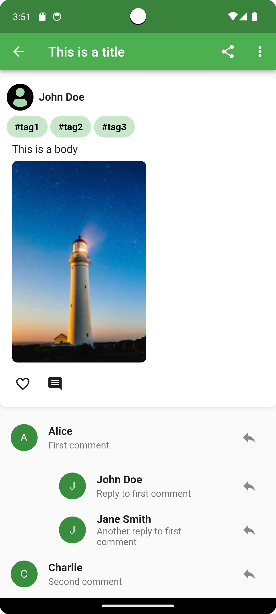

# Dialogue Social - Social Media Front End


Dialogue Social is a social media front-end built using Flutter and Dart. It provides a
user-friendly interface for the Dialogue Social app, allowing users to interact with the platform,
share their thoughts and experiences, and connect with others. This README will guide you through
setting up and running the Dialogue Social front-end project.

## Table of Contents

1. [**Getting Started**](#getting-started)

   - 1.1 [Prerequisites](#prerequisites)
   - 1.2 [Installation](#installation)

2. [**Usage**](#usage)
3. [**Demo**](#demo)

   - 3.1 [Home Page](#home-page)
     - 3.1.1 [Post Page](#post-page)
   - 3.2 [Discover Page](#discover-page)
   - 3.3 [Notifications Page](#notifications-page)
   - 3.4 [Chat Page](#chat-page)
     - 3.4.1 [Individual Chat Page](#individual-chat-page)
   - 3.5 [Profile Page](#profile-page)

4. [**Contributing**](#contributing)

5. [**License**](#license)

## Getting Started

These instructions will help you set up the Dialogue Social front-end project on your local machine.

### Prerequisites

Before you begin, make sure you have the following software and tools installed:

- Flutter: You can install Flutter by following
  the [official installation guide](https://flutter.dev/docs/get-started/install).
- Dart: Flutter uses the Dart programming language, which is included when you install Flutter.
- Git: You'll need Git to clone the repository.
- IDE: Install and configure Visual Studio Code or Android Studio

### Installation

1. Clone the Dialogue Social Front-End repository to your local machine:

   ```bash
   git clone https://github.com/Smit2553/dialogue-social.git
   ```

2. Change your current directory to the project folder:

```bash
cd dialogue-social-front-end
```

3. Install the project dependencies using Flutter:

```bash

    flutter pub get
```

## Usage

To run the Dialogue Social front-end on your local machine, follow these steps:

1. Connect your mobile device or use an emulator.

2. Open a terminal in the project folder and run:

```bash

    flutter run
```

    This command will build and run the app on your connected device or emulator.

    You should now see the Dialogue Social app running on your device. You can explore the app's features and functionalities.

## Demo

### Home Page:


#### Post Page:



### Discover Page:


### Notifications Page:


### Chat Page:


#### Individual Chat Page:


### Profile Page:


## Contributing

This section is work in progress.

We welcome contributions from the community. If you'd like to contribute to the Dialogue Social project feel free to create a pull request.

## License

This project is licensed under the MIT License - see the [LICENSE](LICENSE) file for details.
